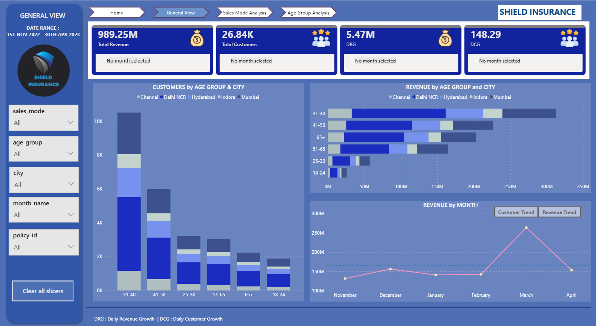

# Insurance Policy Sales & Settlement Analysis
### 🧩 Domain: Insurance
End-to-End Power BI Project | Dimensional Modeling | Customer Demographics | Age Group Insights

**Live Dashboard:** [Click here](https://app.powerbi.com/view?r=eyJrIjoiYzkxOTU3ZmUtZThlOC00YjMxLTljODgtNDM1MmNmMTIwMTI5IiwidCI6ImM2ZTU0OWIzLTVmNDUtNDAzMi1hYWU5LWQ0MjQ0ZGM1YjJjNCJ9)

---

## 📌 Table of Contents
- <a href="#overview">Project Overview</a>
- <a href="#dataset-description">Dataset Description</a>
- <a href="#dimensional-model">Dimensional Model</a>
- <a href="#features-built">Features Built</a>
- <a href="#dax-measures">DAX Measures</a>
- <a href="#tools-used">Tools Used</a>
- <a href="#conclusion">Conclusion</a>
- <a href="#author--contact">Author & Contact</a>

---

## 🧾 Project Overview

This project analyzes customer behavior, policy performance, and settlement trends for an insurance company using dimensional modeling and Power BI.
The goal is to help stakeholders understand:

•	Revenue trends
•	Customer growth
•	Sales mode performance
•	Age-group behavior
•	City-level segmentation
•	Settlement patterns

The project follows a clean Ask → Prepare → Process → Analyze → Share lifecycle.

## 🧩 Dataset Description

### The project is based on 5 CSV files:

•	dim_customer.csv – Customer details
•	dim_date.csv – Calendar table
•	dim_policies.csv – Policy information
•	fact_premiums.csv – Policy purchase transactions
•	fact_settlements.csv – Age-wise settlement percentages

### Dimensional model:

•	dim_customer → fact_premiums (1:many)
•	dim_date → fact_premiums (1:many)
•	dim_policies → fact_premiums (1:many)
•	dim_age (created in Power Query) → dim_customer (1:many)

## 💡 Features Built (KPIs & Visuals)

## Key Metrics:

•	Total Customers
•	Total Revenue
•	Daily Revenue Growth Rate
•	Daily Customer Growth Rate

## Filters:

•	Sales Mode
•	Age Group
•	City
•	Month
•	Policy ID

## 🖥 Report Pages

### 1️⃣ General View

•	Customer by Age Groups & City
•	Revenue by Age Group & City
•	Customers Trend
•	Revenue Trend

### 📷 Dashboard Preview 

### 🔍 Key Metrics

Total Revenue: ₹989.25M
Total Customers: 26.84K
DRG: 5.47M (Daily Revenue Growth)
DCG: 148.29 (Daily Customer Growth)

### 🔎 Insights

•	Revenue contribution is concentrated within specific age groups (31-40) and cities (Delhi NCR), indicating clear high-value customer segments.
•	Monthly growth trends reveal periodic spikes and slowdowns, suggesting the influence of seasonality and campaign timing.
•	Positive MoM growth in revenue outpaces customer growth in certain periods, indicating improved customer value rather than pure volume expansion.

### 💡 Recommendations

1.	Prioritize high-revenue age groups and cities for retention and upsell initiatives.
2.	Improve monetization in high-customer but low-revenue regions through pricing and cross-sell strategies.
3.	Track MoM trends to assess growth consistency and campaign effectiveness.

### 2️⃣ Sales Mode Analysis

•	Revenue by Sales Mode
•	Customer by Sales Mode
•	Customers Trend
•	Revenue Trend

### 📷 Dashboard Preview 

### 🔎 Insights

•	Sales modes (Offline-Ageent) is same in customer acquisition versus revenue contribution, highlighting volume-driven and value-driven channels.
•	Monthly trends show Offline Agent mode shows preference over time, reflecting customer behavior and distribution effectiveness.

### 💡 Recommendations
1.	Strengthen investment in sales modes delivering high revenue and positive MoM growth.
2.	Monitor monthly trends to identify channel shifts and performance risks early.

### 3️⃣ Age Group Analysis

•	Policy Preference by Age Group
•	Settlement % by Age Group
•	Sales mode preference per age segment

### 📷 Dashboard Preview 

### 🔎 Insights

•	Sales mode preference is similar across age group.
•	Policy preferences are similar across all age-group.
•	Aligning product, channel, and engagement strategies by age group can significantly improve acquisition efficiency and customer lifetime value.

### 💡 Recommendations
1.	Align sales modes with age-specific preferences to improve acquisition efficiency.
2.	Customize policy offerings based on dominant preferences within each age segment.
  
With these strategies, we can improve acquisition in low-performing segments and enhance profitability of high-contributing age groups.

## 🧮 Important DAX Measures

Total Customers =
DISTINCTCOUNT(fact_premiums[customer_code])

Total Revenue =
SUM(fact_premiums[final_premium_amt(INR)])

Average Daily Revenue = 
AVERAGEX (
    FILTER (
        VALUES ( dim_date[date] ),
        NOT ISBLANK ( [Total Revenue] )
    ),
    [Total Revenue]
)

Avg Daily Customer = 
AVERAGEX (
    VALUES ( dim_date[date] ),
    [Total Customers]
)

## 🛠 Tools Used

•	Power BI
•	Power Query (ETL)
•	MySQL (optional)
•	Excel (data cleaning)

## 📌 Conclusion

This report provides a 360° view of the insurance business, enabling stakeholders to:

•	Understand revenue & customer behavior
•	Identify high-value age groups & cities
•	Optimize sales channels
•	Forecast settlement risk

<h2>Author & Contact</h2>

**Rita Mahato**  

Data Analyst 

📧 Email: ds.rita.mahato@gmail.com  

🔗 [LinkedIn](https://www.linkedin.com/in/mahato-rita/)  

