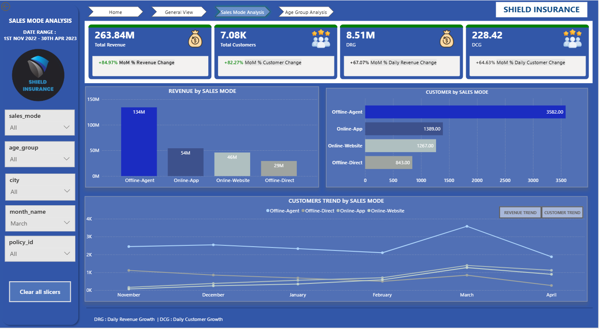
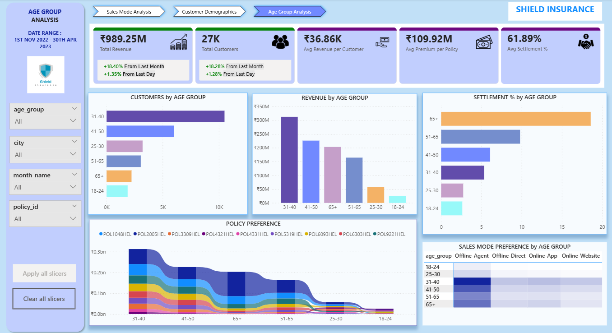

# Insurance Policy Sales & Settlement Analysis
### 🧩 Domain: Insurance
End-to-End Power BI Project | Dimensional Modeling | Customer Demographics | Age Group Insights

**Live Dashboard:** [Click here](https://app.powerbi.com/view?r=eyJrIjoiM2M2NWE2NzctMjBmMi00ZWIxLWIyNTItNGFlNWMxOTljMWMwIiwidCI6ImM2ZTU0OWIzLTVmNDUtNDAzMi1hYWU5LWQ0MjQ0ZGM1YjJjNCJ9)

---

## 📌 Table of Contents
- <a href="#overview">Project Overview</a>
- <a href="#dataset-description">Dataset Description</a>
- <a href="#dimensional-model">Dimensional Model</a>
- <a href="#business-questions">Business Questions</a>
- <a href="#features-built">Features Built</a>
- <a href="#dax-measures">DAX Measures</a>
- <a href="#tools-used">Tools Used</a>
- <a href="#conclusion">Conclusion</a>
- <a href="#author--contact">Author & Contact</a>

---

## 🧾 Project Overview

This project analyzes customer behavior, policy performance, and settlement trends for an insurance company using dimensional modeling and Power BI.
The goal is to help stakeholders understand:

•	Revenue trends

•	Customer growth

•	Sales mode performance

•	Age-group behavior

•	City-level segmentation

•	Settlement patterns

The project follows a clean Ask → Prepare → Process → Analyze → Share lifecycle.

## 🧩 Dataset Description

### The project is based on 5 CSV files:

•	dim_customer.csv – Customer details

•	dim_date.csv – Calendar table

•	dim_policies.csv – Policy information

•	fact_premiums.csv – Policy purchase transactions

•	fact_settlements.csv – Age-wise settlement percentages

### Dimensional model:

•	dim_customer → fact_premiums (1:many)

•	dim_date → fact_premiums (1:many)

•	dim_policies → fact_premiums (1:many)

•	dim_age (created in Power Query) → dim_customer (1:many)

## 🎯 Business Questions

### Sales Performance

•	What is the total revenue and monthly revenue trend?

•	Which sales mode performs best (Agent, Direct, App, Website)?

•	What is the daily & monthly customer growth rate?

### Customer Demographics

•	Which cities contribute the most revenue?

•	How do revenue and customer counts vary by city and age group?

### Age Group Analysis

•	Which age group buys more policies?

•	Which age group prefers which sales mode?

•	What is the expected settlement by age segment?

## 💡 Features Built (KPIs & Visuals)

## Key Metrics:

•	Total Customers

•	Total Revenue

•	Daily Revenue Growth Rate

•	Daily Customer Growth Rate

•	Monthly Revenue & Customer Trend

•	Revenue Split by Sales Mode

•	Customer Segmentation by City & Age Group

## Filters:

•	Sales Mode

•	Age Group

•	City

•	Month

•	Policy ID

## 🖥 Report Pages

### 1️⃣ Sales Mode Analysis

•	Customer by sales mode

•	Monthly trend (line chart)

•	Revenue split (pie chart)

•	Revenue by sales mode

### 📷 Dashboard Preview 

### 🔍 Key Metrics

Total Revenue: ₹989.25M

Total Customers: 27K

Avg Revenue per Customer: ₹36.86K

Avg Premium per Policy: ₹109.92M

Avg Settlement Rate: 61.89%

### 🔎 Insights

This page helps us understand how customers bought policies across channels.

•	We see that offline-agent sales contribute the majority share (56%), indicating strong dependence on agent-driven acquisition.

•	Online-app and website channels are emerging but relatively lower, highlighting digital adoption potential.

•	Revenue trend month-wise shows steady growth with a seasonal spike around March.

### 💡 Recommendations

1.	Ramp digital onboarding programs, offer online discounts/cashback.
2.	Design self-service insurance purchase journey.
3.	Add chatbot-assisted claim + renewal workflow.
4.	Use agent network for high-ticket policies, online for volume.

### 2️⃣ Customer Demographics

•	Customer distribution by city

•	Revenue distribution

•	Age group segmentation

•	Growth insights

### 📷 Dashboard Preview 

### 🔎 Insights

This dashboard gives a consolidated view of the insurance business, showing revenue, customer count, premium details and settlement percentages.
It helps us understand not just how many customers we have, but also who they are and how they interact with insurance products.

•	31–40 is the dominant customer segment
•	Delhi NCR, Mumbai, Hyderabad are the strongest sales regions
•	March sees the highest customer activity
•	Settlement success is highest among middle-aged groups
•	Youth (18–24) and seniors (65+) show lower engagement/settlement performance
•	Revenue and customer growth trend is positive month-to-month.

### 💡 Recommendations
1.	Increase marketing focus on 31–50 age group, the most profitable customer cluster.
2.	Create awareness plans or financial-friendly plans for 18–24 age group to attract young buyers.
3.	Improve support & claim experience for 65+ customers, boosting trust.
4.	Expand market campaigns in Delhi NCR, Mumbai, Hyderabad, while increasing outreach in Chennai and Indore.
5.	Since March peaks strongly, pre-March promotional campaigns can help boost conversions further."

### 3️⃣ Age Group Analysis

•	Customers by age group

•	Revenue by age group

•	Policy preference per age segment

•	Sales mode preference per age segment

•	Expected settlement % (standalone insight)

### 📷 Dashboard Preview 

### 🔎 Insights

#### Customer & Revenue Insights

•	The 31–40 age group dominates with the highest number of customers and revenue, making it our core segment.

•	Revenue contribution order:
31–40 > 41–50 > 65+ > 51–65 > 25–30 > 18–24

•	Interestingly, though 65+ has lower customer count, it shows one of the highest settlement percentages, indicating a greater claim need in senior customers.

•	The 18–24 segment is the weakest, both in customer count, revenue, and settlement.

#### Policy Preference

•	Policy variation is widely distributed, but 31–40 & 41–50 age groups show diverse adoption across multiple plans, suggesting strong demand adaptability.

•	Younger customers (<30) buy fewer policies, indicating low engagement and lesser insurance awareness.

### 💡 Recommendations
1.	Focus marketing & cross-sell campaigns on 31–50 age groups, our strongest revenue generators.
2.	Create special premium plans for 65+, with medical benefits, given high settlement usage.
3.	Launch student/first-jobber low-cost starter policies to attract 18–30 segment customers.
4.	Improve claim settlement process to increase trust and overall customer satisfaction.
   
With these strategies, we can improve acquisition in low-performing segments and enhance profitability of high-contributing age groups.

## 🧮 Important DAX Measures

Total Customers =
DISTINCTCOUNT(fact_premiums[customer_code])

Total Revenue =
SUM(fact_premiums[final_premium_amt(INR)])

Daily Revenue Growth = 
VAR PrevDay = CALCULATE([Total Revenue], DATEADD(dim_date[date], -1, DAY))
RETURN DIVIDE([Total Revenue] - PrevDay, PrevDay)

Daily Customer Growth = 
VAR PrevDay =
    CALCULATE(
        [Customers Per Day],
        DATEADD(dim_date[date], -1, DAY)
    )
RETURN
DIVIDE([Customers Per Day] - PrevDay, PrevDay)

## 🛠 Tools Used

•	Power BI

•	Power Query (ETL)

•	MySQL (optional)

•	Excel (data cleaning)

## 📌 Conclusion

This report provides a 360° view of the insurance business, enabling stakeholders to:

•	Understand revenue & customer behavior

•	Identify high-value age groups & cities

•	Optimize sales channels

•	Forecast settlement risk

<h2>Author & Contact</h2>

**Rita Mahato**  

Data Analyst 

📧 Email: ds.rita.mahato@gmail.com  

🔗 [LinkedIn](https://www.linkedin.com/in/mahato-rita/)  

